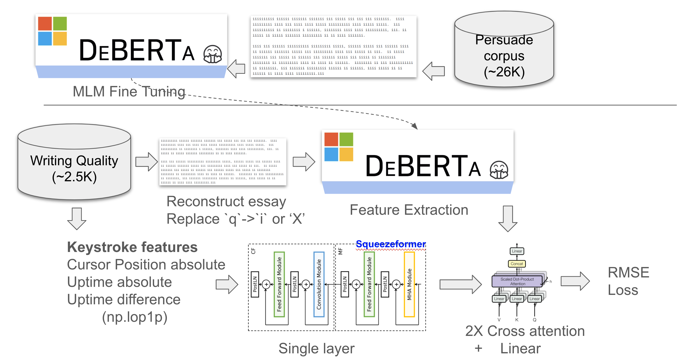

## Linking Writing Processes to Writing Quality - 3rd place solution

This repository contains the codebase to reproduce the winning solution to the Linking Writing Processes to Writing Quality competition. 

Competiton website: [link](https://www.kaggle.com/c/linking-writing-processes-to-writing-quality/overview).  
3rd place solution summary: [link](https://www.kaggle.com/competitions/linking-writing-processes-to-writing-quality/discussion/466906). 

Our solution is an ensemble of two parts. Firstly, we build a Gradient Boosted Trees (GBT) ensemble based on popular public features on essay level. Secondly, we build an ensemble of deberta models using the final essay text, which have been mlm-pretrained on persuade corpus where we obscured the essays similar to the competitions train set. We weight GBT-Ensemble and deberta-ensemble by a ratio of 40/60.
  
This repo primarily cover the the second part. 



## Preparation

### DeBERTa model pipeline 
Pretrain the DeBERTa base models (v1 and v3) on obscured essays similar to the competition dataset. 
```
ln -s scripts/pretrain_mlm_v06.py
python pretrain_mlm_v06b.py
python pretrain_mlm_v06h.py
python pretrain_mlm_v06i.py
python pretrain_mlm_v06k.py
python pretrain_mlm_v06e4.py
python pretrain_mlm_v06k_ch2d.py
``` 
  
Train the three deberta models for 16 seeds. Training for multiple seeds reduces variance seen in the results.  
```
for i in {1..16}
do
   python train.py -C cfg_ch_8e6 --fold -1
   python train.py -C cfg_ch_10d --fold -1
   python train.py -C cfg_dh_36bd --fold -1
   python train.py -C cfg_dh_49b --fold -1
   python train.py -C cfg_dh_39j --fold -1
   python train.py -C cfg_ch_7d --fold -1
   python train.py -C cfg_dh_39f --fold -1
done
```
The weights will be saved to a subdirectory in `weights/cfg*/fold-1/`. For each config file, create a kaggle datasets and link it to the public script. You can find an exaample [here](https://www.kaggle.com/code/darraghdog/3rd-place-deberta-weights-cfg-dh-39a).
  
### MLP model pipeline
Steps to install denselight for train the MLP model.
```
# Install denselight
pip install pkgs/lightautoml-0.3.8-py3-none-any.whl
pip install lightautoml

# Download competition data
kaggle competitions download -c linking-writing-processes-to-writing-quality
unzip linking-writing-processes-to-writing-quality.zip
rm linking-writing-processes-to-writing-quality.zip

# Pull this file to use the parameters
kaggle datasets download -d darraghdog/lama-model-params
unzip lama-model-params.zip
rm lama-model-params.zip
```
To train the MLP, run the below,
```
ln -s scripts/train_mlp.py
python train_mlp.py
```
 
The weights will be saved to a subdirectory in `weights/denselight`. For each config file, create a kaggle datasets and link it to the public script. 

### Other TFIDF based models, 

The following scripts need to be run, they can be forked from the Kaggle notebooks. 
Find the [input](https://www.kaggle.com/code/darraghdog/3rd-place-lwq/input) scripts to the inference botebook - the scripts beginning with `ch_*`, `public_cb_1*` and the `silver-bullet-mlp-train-v04` need to be run and attached to the inference script. 
 
## Inference
Find the notebook [3rd-place-lwq](https://www.kaggle.com/code/darraghdog/3rd-place-lwq/input) for inference.

## References

We adapted squeezeformer components from this repository: 
- SqueezeFormer (pytorch) https://github.com/upskyy/Squeezeformer/

Check out the SqueezeFormer [paper](https://arxiv.org/pdf/2206.00888.pdf) for more details on the architecture. 
Also, you have the DeBERTa paper for [v1](https://arxiv.org/abs/2006.03654) and [v3](https://arxiv.org/abs/2111.09543).


